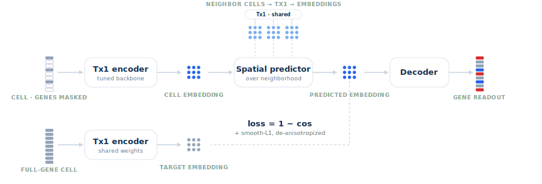
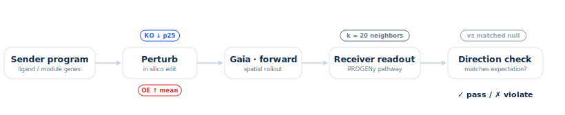
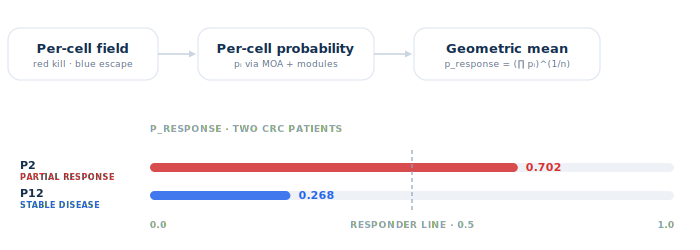
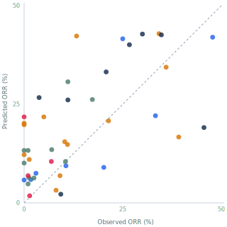

# Open Benchmarks

Open benchmark code and release summaries for the Gaia oncology benchmark suite
described in the [AlunaData blog](https://blog.alunadata.com/).

The suite has three layers:

- **BioBench**: spatial tissue-biology perturbation checks.
- **Patient-level bench**: pretreatment patient-section response prediction.
- **Cohort-level bench**: trial-arm or drug-by-disease ORR prediction.

This repository contains benchmark loaders, scoring utilities, baseline scripts,
and small result summaries. It intentionally does not commit raw spatial data,
model checkpoints, per-cell caches, full row-level prediction tables, or large
external source matrices.

## Figures

Selected raw rendered SVG figures from the
[Gaia blog](https://blog.alunadata.com/) are included here as local README
assets. They come from the local Terra blog project at
`/Users/davidchu/Desktop/projects/spatial-fun/deploy/terra-demo-standalone/src/components/`.

<p align="center">
  
</p>

<p align="center">
  
</p>

<p align="center">
  
</p>

<p align="center">
  
</p>

The cohort ORR figure is the blog display. The packaged cohort benchmark
artifacts below are the 63-row production v2 release.

## BioBench

BioBench tests whether a spatial model moves known tissue biology in the right
direction. A row is a falsifiable biology statement: edit a sender program in
silico, roll the spatial model forward over the local neighborhood, and check
whether a receiver pathway or readout moves in the curated direction.

The blog describes two BioBench row families:

- **Ligand-receptor pathway rows**: a sender ligand family should move a
  receptor-positive receiver pathway.
- **Regional tissue-program rows**: broader tissue programs, such as CAF/ECM,
  hypoxia, vascular niche, cytotoxic immune, or checkpoint-contact programs,
  should move downstream tissue readouts.

Release utilities:

- `src/spatial_benchmarks/biobench_v3.py`
- `open-benchmarks biobench-v3-summary --root artifacts/biobench_v3`

Public row artifacts:

- `biobench/legacy_v2/biobench_v2_manifest_clean.csv`: older BioBench v2
  clean row set, 630 rows.
- `biobench/legacy_v2/biobench_v2_manifest_unfiltered.csv`: older BioBench v2
  audit-inclusive row set, 805 rows.
- `biobench/legacy_v2/biobench_v2_ligand_modules.csv`: 23 v2 ligand modules.

## Patient-Level Bench

The patient-level benchmark asks whether a pretreatment spatial section can
predict later clinical response for the same patient. The current release
focuses on longitudinal metastatic CRC sections treated with KRAS-axis plus
EGFR-axis regimens.

The key design choice is label-free scoring: response probability is assembled
from interpretable predicted biology, such as tumor apoptosis, growth arrest,
escape, and mechanism-specific axes. It is not fit to the response labels.

Release utilities:

- `src/spatial_benchmarks/patient_crc.py`
- `open-benchmarks patient-crc-metrics --scores artifacts/patient_crc/scores.csv`

Public clinical row artifacts:

- `patient-level-bench/clinical_rows/universal_patient_response_axes_clinical_rows_20260525.csv`:
  23 patient-level clinical label rows across CRC and cSCC.
- `patient-level-bench/clinical_rows/crc_patient_clinical_rows_20260525.csv`:
  11 CRC regimen/outcome clinical rows.

These row files include row identifiers and clinical labels/metadata only; they
exclude model score, probability, and per-cell output columns.

Public CRC patient model score artifacts:

- `patient-level-bench/model_scores/crc_moa_tailored_20260525/crc_patient_moa_tailored_rank_scores_20260525.csv`:
  11 CRC patient rows with broad module supports and the default calibrated
  rank score.
- `patient-level-bench/model_scores/crc_moa_tailored_20260525/crc_patient_moa_tailored_metrics_20260525.csv`:
  label-free metrics for the default calibrated rank score.

The CRC default score is `response_score_rank_calibrated`, with AUC response
high `0.800` and fixed 0.5 balanced accuracy `0.733`. It summarizes KRAS/MAPK,
EGFR, cytostasis, escape-control, and kill-conversion module supports into a
label-free soft-min response intermediate, then converts that intermediate into
a within-panel rank score. It is a benchmark rank score, not an absolute
response probability. See
`docs/universal_softmin_crc_patient_rank_score.md`.

## Cohort-Level Bench

The cohort-level benchmark asks the same response question at trial-arm scale.
For each drug-by-disease row, patient-section response probabilities are
aggregated into a predicted ORR and compared with observed ORR.

This surface trades patient-level precision for coverage across drugs and
diseases. It is noisier than matched patient response, but it tests whether
spatial rollout scores recover clinically meaningful response differences
without training on observed ORR.

Release utilities:

- `src/spatial_benchmarks/cohort_v2.py`
- `open-benchmarks cohort-v2-metrics --root artifacts/cohort_benchmark_v2`
- `cohort-level-bench/`

The blog reports the strict public cohort-level display on 44 ORR pairs. The
baseline scripts in this repo target the 63 ORR-scored production v2 rows used
for the Atlas and DepMap baseline analysis.

Public clinical row artifacts:

- `cohort-level-bench/clinical_rows/cohort_benchmark_v2_clinical_rows.csv`:
  all 69 cohort-drug rows.
- `cohort-level-bench/clinical_rows/cohort_benchmark_v2_orr_labeled_clinical_rows.csv`:
  66 rows with finite ORR labels.
- `cohort-level-bench/clinical_rows/cohort_benchmark_v2_eval_clinical_rows.csv`:
  63 evaluation rows with finite ORR labels and finite default scores.

These row files include clinical label and row metadata only; they exclude the
full prediction and patient-probability columns.

Public Gaia model score artifacts:

- `cohort-level-bench/model_scores/gaia/gaia_63_model_scores.csv`:
  all 63 ORR-scored evaluation rows with the active/default Gaia score and
  candidate score sidecars.
- `cohort-level-bench/model_scores/gaia/gaia_best_63_model_scores.csv`:
  focused 63-row table with the active/default score and the best packaged
  Pearson/Spearman sidecar scores, plus the universal softmin sidecar.
- `cohort-level-bench/model_scores/gaia/gaia_metrics.csv`:
  global metrics for the active/default and candidate score columns.
- `cohort-level-bench/model_scores/gaia/audit_logs/`:
  compact input-comparability and susceptibility audit artifacts.

The active/default Gaia score is `apoptosis_prevalence_no_prior_score`,
with Pearson `0.511`, Spearman `0.520`, and AUC above disease median `0.765`
on the 63 ORR-scored rows. The best packaged 63-row Pearson sidecar is
`prob_apoptosis_prevalence_orr_gt_20pct`, with Pearson `0.650`, Spearman
`0.564`, and AUC above disease median `0.735`. The universal softmin sidecar
`universal_axis_softmin_response_probability_mean` is also included explicitly,
with Pearson `0.646`, Spearman `0.519`, and AUC above disease median `0.775`.
These are label-aware leaderboard summaries across precomputed sidecars, not
the active/default release score. The full production prediction table and
patient-probability table are not included.

Calculation note: `universal_axis_softmin_response_probability_mean` is the
cohort-level mean of per-patient `universal_axis_softmin_response_probability`,
where each patient score is `min(final axis support values)`. It uses the same
soft-min response-gate idea as the CRC patient module score, but it is not the
same calculation. See `docs/universal_softmin_crc_patient_rank_score.md`.

## Cohort-Level Baselines

The cohort-level benchmark includes external-data baselines in
`cohort-level-bench/baseline/`.

Atlas ORR prior:

- Script: `cohort-level-bench/baseline/atlas_orr_baseline.py`
- Results: `cohort-level-bench/baseline/results/atlas_orr_metrics.csv`
- Primary score: `atlas_mono_disease_therapy_shrink_k8`
- Strict release result on 63 rows: Pearson `0.409`, Spearman `0.464`, AUC
  above disease median `0.742`, MAE `11.59` ORR percentage points.
- What it uses: target disease, target therapy family, historical Atlas
  `model_orr_pct`, and Atlas arm support/filters.
- What it does not use: observed ORR labels to make predictions, production
  spatial-model scores, tumor biology features, exact target drug arms, DepMap,
  or a fitted model over the 63 rows.
- Cleaning: removes the 3 ClinicalTrials.gov value mismatches, 8
  no-matching-ORR support rows, and 2 CTGov-verified endpoint caveat rows that
  are not strict CR/PR ORR before recomputing the prior.
- Overfit check: fixed `k=8` is not label-tuned; strict leave-disease-out
  Spearman-tuned shrinkage reaches Pearson `0.292`, Spearman `0.419`.
- LODO tuning script: `cohort-level-bench/baseline/atlas_orr_lodo_tuning.py`.
- LODO fit records:
  `cohort-level-bench/baseline/results/atlas_orr_lodo_fit_records.csv`.
- ClinicalTrials.gov ORR audit:
  `cohort-level-bench/baseline/results/atlas_orr_ctgov_audit.csv`.
- CTGov audit status: 191 of 202 unique Atlas support rows verified directly
  against ClinicalTrials.gov; the 11 exception rows are excluded from the
  public Atlas score and retained only as audit provenance.
- Support reasonableness audit: no exact-drug leakage; the strict release
  score removes two additional CTGov-verified endpoint-title caveats, leaving
  189 audited support rows.

DepMap drug sensitivity:

- Script: `cohort-level-bench/baseline/depmap_orr_baseline.py`
- Results: `cohort-level-bench/baseline/results/depmap_orr_metrics.csv`
- Primary score: `depmap_lineage_sensitivity_rank`
- Result on 55 covered rows out of 63: Pearson `-0.067`, Spearman `-0.062`,
  AUC above disease median `0.475`.

Atlas is the stronger transparent baseline. DepMap is included as a useful
negative external-data baseline on this cohort-level ORR surface.

## Install

```bash
python -m pip install -e ".[dev]"
```

The package uses only the Python standard library at runtime. Development
checks use `pytest` and `ruff`.

## CLI Examples

Summarize an exported BioBench v3 snapshot:

```bash
open-benchmarks biobench-v3-summary \
  --root artifacts/biobench_v3 \
  --surface curated
```

Recompute cohort benchmark v2 metrics:

```bash
open-benchmarks cohort-v2-metrics --root artifacts/cohort_benchmark_v2
```

Compute CRC patient metrics from a public or sanitized score table:

```bash
open-benchmarks patient-crc-metrics \
  --scores artifacts/patient_crc/universal_patient_response_axes_scores_20260525.csv
```

Run the Atlas cohort-level ORR baseline:

```bash
python cohort-level-bench/baseline/atlas_orr_baseline.py \
  --atlas-csv /path/to/spatial-fun/atlas/results/ctgov_phase2_solid_tumor_atlas_cohorts_pubmed_supplement.csv \
  --cohort-predictions /path/to/spatial-fun/production/full_benchmark/cohort_benchmark_v2/predictions.csv \
  --output-dir artifacts/atlas_orr_baseline \
  --strict-release-cleaning
```

The strict release run uses the raw Atlas source plus
`--strict-release-cleaning`, which removes the 13 reviewed raw Atlas row
indices listed in `cohort-level-bench/baseline/results/atlas_orr_summary.json`.

Run the Atlas leave-disease-out tuning sensitivity check:

```bash
python cohort-level-bench/baseline/atlas_orr_lodo_tuning.py \
  --atlas-csv /path/to/spatial-fun/atlas/results/ctgov_phase2_solid_tumor_atlas_cohorts_pubmed_supplement.csv \
  --cohort-predictions /path/to/spatial-fun/production/full_benchmark/cohort_benchmark_v2/predictions.csv \
  --output-dir artifacts/atlas_orr_lodo_tuning \
  --strict-release-cleaning
```

Run the Atlas ClinicalTrials.gov ORR support audit:

```bash
python cohort-level-bench/baseline/atlas_orr_ctgov_audit.py \
  --atlas-csv /path/to/spatial-fun/atlas/results/ctgov_phase2_solid_tumor_atlas_cohorts_pubmed_supplement.csv \
  --cohort-predictions /path/to/spatial-fun/production/full_benchmark/cohort_benchmark_v2/predictions.csv \
  --output-dir artifacts/atlas_orr_ctgov_audit \
  --cache-dir artifacts/ctgov_api_cache
```

Run the DepMap cohort-level ORR baseline:

```bash
python cohort-level-bench/baseline/depmap_orr_baseline.py \
  --depmap-drug-dir /path/to/spatial-fun/data/depmap/drug \
  --model-csv /path/to/spatial-fun/data/depmap/Model.csv \
  --cohort-predictions /path/to/spatial-fun/production/full_benchmark/cohort_benchmark_v2/predictions.csv \
  --output-dir artifacts/depmap_orr_baseline
```

## Artifact Policy

This repo is code-and-summary oriented. Keep large or sensitive artifacts
external unless they have been explicitly approved for public release:

- Raw spatial `h5ad`, per-cell, per-gene, and per-patient tables.
- Model checkpoints and runtime caches.
- Raw Atlas curation tables beyond approved public source artifacts.
- Raw DepMap matrices, which should retain their own provenance and license
  notes.
- Model-score and probability row outputs outside the compact clinical-row
  manifests checked in under `patient-level-bench/clinical_rows/` and
  `cohort-level-bench/clinical_rows/`.

Use [docs/source_artifacts.md](docs/source_artifacts.md) as the source-file
checklist for rebuilding public bundles.
