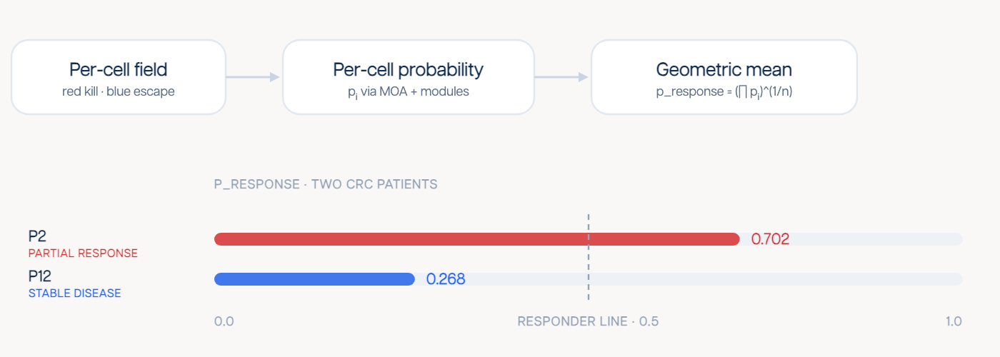
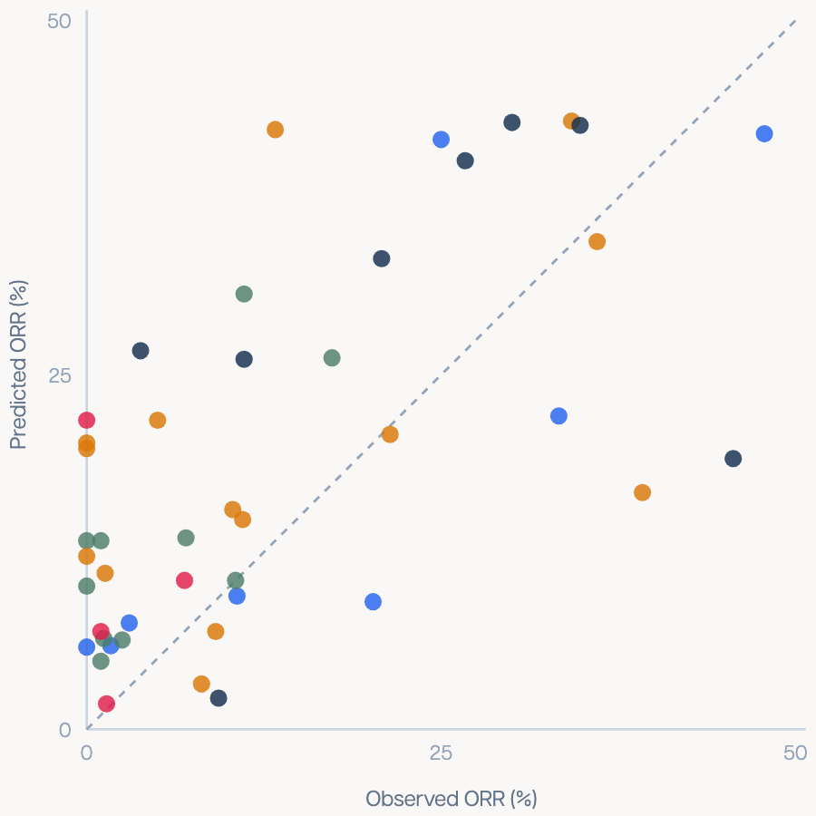

# Open Benchmarks

Open benchmark code and release summaries for the Gaia oncology benchmark suite
described in the [AlunaData blog](https://blog.alunadata.com/).

This release contains two benchmark layers:

- **Patient-level bench**: pretreatment patient-section response prediction.
- **Cohort-level bench**: drug-by-disease objective response rate (ORR)
  prediction.

BioBench is intentionally not included in this repository yet.

The detailed row, score, metric, and baseline methodology is in
`docs/methodology.md`; the blog/Tahoe number cross-check is in
`docs/alignment_report.md`.

## Patient-Level Bench

The patient-level benchmark asks whether a pretreatment spatial section can
predict later clinical response for the same patient. The current public score
artifact focuses on 11 metastatic CRC patients treated with KRAS-axis plus
EGFR-axis regimens.

<p align="center">
  
</p>

Public artifacts:

- `patient-level-bench/clinical_rows/crc_patient_clinical_rows_20260525.csv`
- `patient-level-bench/model_scores/crc_moa_tailored_20260525/crc_patient_moa_tailored_rank_scores_20260525.csv`
- `patient-level-bench/model_scores/crc_moa_tailored_20260525/crc_patient_moa_tailored_metrics_20260525.csv`
- `patient-level-bench/observed_readouts/crc_on_treatment_p_response_20260604/crc_on_treatment_p_response_readout_metrics.csv`

The public CRC score is `response_score_rank_calibrated`. It summarizes
KRAS/MAPK, EGFR, cytostasis, escape-control, and kill-conversion module
supports into a label-free soft-min response intermediate, then converts that
intermediate into a within-panel rank score. It is a benchmark rank score, not
an absolute response probability.

Released CRC metrics:

- Rows: `11`
- AUC response high: `0.800`
- Fixed 0.5 balanced accuracy: `0.733`

See `docs/methodology.md` and
`docs/universal_softmin_crc_patient_rank_score.md` for the calculation.

Observed on-treatment p_response readout:

- Rows: `11`
- AUC PR-high: `0.867`
- Fixed 0.5 balanced accuracy: `0.917`
- Boundary: uses measured on-treatment tissue state; not a pretreatment
  prediction benchmark.

## Cohort-Level Bench

The cohort-level benchmark asks the same response question at trial-arm scale.
Each row is a strict observed ORR cohort-drug pair with a Gaia predicted ORR
percentage. The public target is the 44-row strict ORR set used by the Tahoe
cohort figure.

<p align="center">
  
</p>

Public artifacts:

- [cohort-level-bench/clinical_rows/cohort_benchmark_strict44_clinical_rows.csv](cohort-level-bench/clinical_rows/cohort_benchmark_strict44_clinical_rows.csv)
- [cohort-level-bench/model_scores/gaia/gaia_44_strict_orr_model_scores.csv](cohort-level-bench/model_scores/gaia/gaia_44_strict_orr_model_scores.csv)
- [cohort-level-bench/model_scores/gaia/gaia_metrics.csv](cohort-level-bench/model_scores/gaia/gaia_metrics.csv)
- [cohort-level-bench/model_scores/gaia/gaia_model_score_summary.json](cohort-level-bench/model_scores/gaia/gaia_model_score_summary.json)

The public cohort score is `gaia_predicted_orr_pct`, evaluated directly against
`orr_pct`.

Released cohort metrics:

- Strict ORR pairs: `44`
- Pearson r: `0.650`
- Spearman rho: `0.594`
- Mean absolute ORR gap: `10.2` percentage points
- AUC above disease median: `0.752`

Only the strict 44-row cohort target is linked in this release. See
`docs/methodology.md` for row construction, metric definitions, and score
boundaries.

## Cohort-Level Baselines

Baseline scripts and checked-in 44-row results live under
`cohort-level-bench/baseline/`.

Atlas ORR prior:

- Script: `cohort-level-bench/baseline/atlas_orr_baseline.py`
- Results: `cohort-level-bench/baseline/results/atlas_orr_metrics.csv`
- Primary score: `atlas_mono_disease_therapy_shrink_k8`
- Target rows: `44`
- Pearson r: `0.465`
- Spearman rho: `0.460`
- MAE: `11.3` ORR percentage points

The Atlas prior uses target disease, broad therapy family, historical Atlas
trial-arm ORR, and exact-drug exclusion. It does not use target observed ORR,
Gaia scores, tumor biology, exact target drug Atlas arms, DepMap, or a fitted
model over the target rows.

DepMap drug sensitivity:

- Script: `cohort-level-bench/baseline/depmap_orr_baseline.py`
- Results: `cohort-level-bench/baseline/results/depmap_orr_metrics.csv`
- Primary score: `depmap_lineage_sensitivity_rank`
- Target rows: `44`
- Covered rows: `40`
- Pearson r: `-0.014`
- Spearman rho: `-0.044`

DepMap is included as a negative external-data baseline on the same 44-row ORR
surface.

## Install

```bash
python -m pip install -e ".[dev]"
```

The package uses only the Python standard library at runtime. Development
checks use `pytest` and `ruff`.

## Recompute

Run the Atlas baseline:

```bash
python cohort-level-bench/baseline/atlas_orr_baseline.py \
  --atlas-csv /path/to/spatial-fun/atlas/results/ctgov_phase2_solid_tumor_atlas_cohorts_pubmed_supplement.csv \
  --cohort-predictions cohort-level-bench/model_scores/gaia/gaia_44_strict_orr_model_scores.csv \
  --output-dir artifacts/atlas_orr_baseline \
  --surface-score-column gaia_predicted_orr_pct \
  --strict-release-cleaning
```

Run the DepMap baseline:

```bash
python cohort-level-bench/baseline/depmap_orr_baseline.py \
  --depmap-drug-dir /path/to/spatial-fun/data/depmap/drug \
  --model-csv /path/to/spatial-fun/data/depmap/Model.csv \
  --cohort-predictions cohort-level-bench/model_scores/gaia/gaia_44_strict_orr_model_scores.csv \
  --output-dir artifacts/depmap_orr_baseline \
  --surface-score-column gaia_predicted_orr_pct
```

## Artifact Policy

This repo is code-and-summary oriented. Raw spatial data, model checkpoints,
per-cell outputs, raw Atlas curation tables, and raw DepMap matrices remain
external source artifacts.
